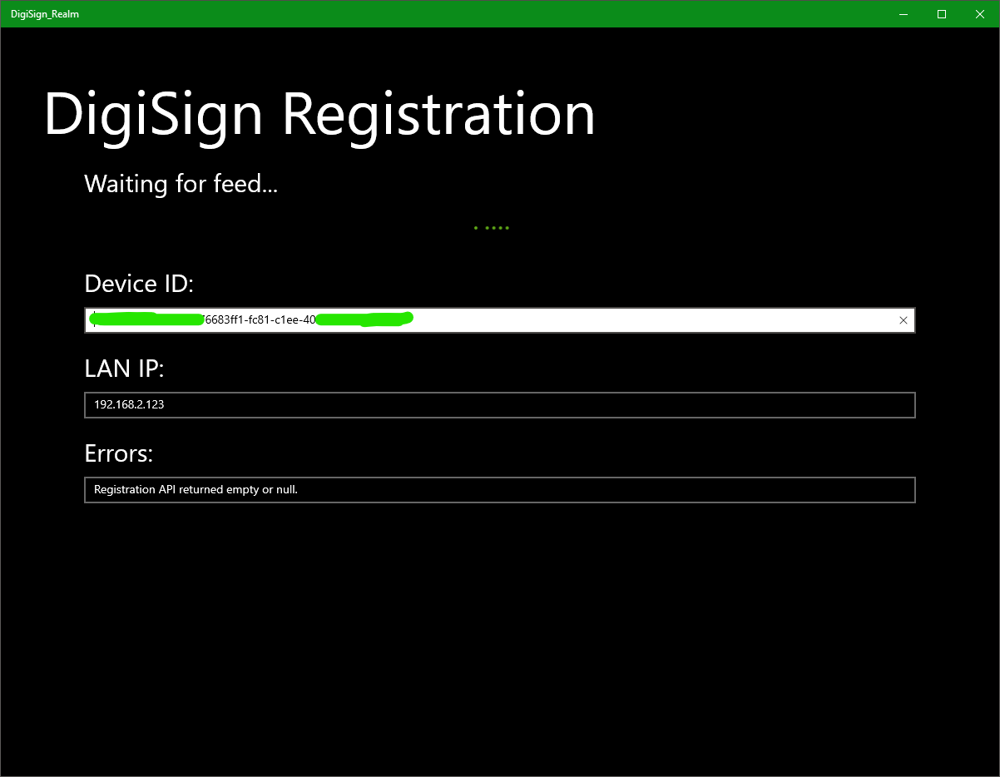
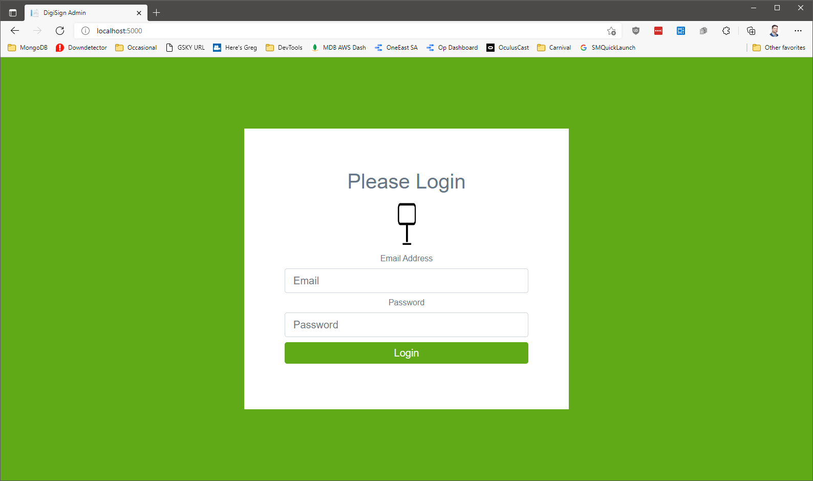
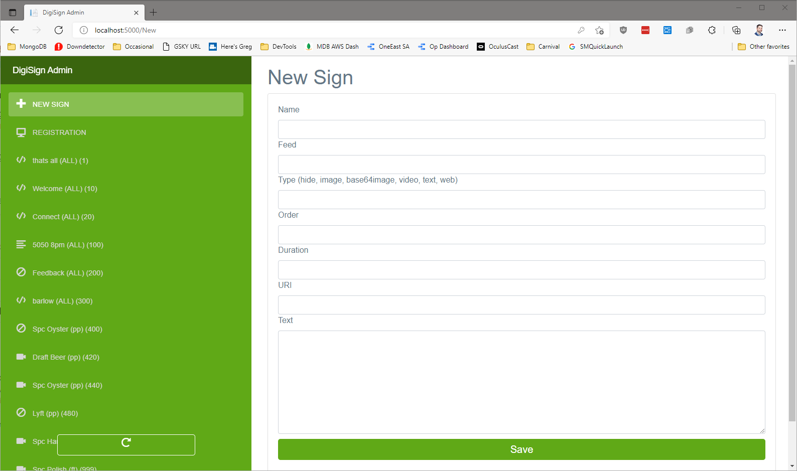
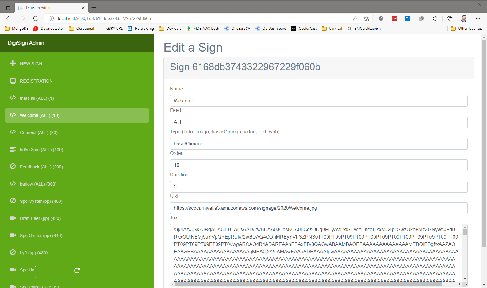
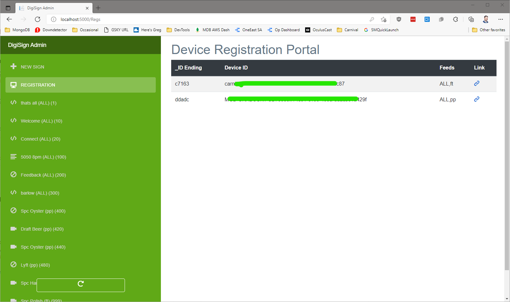

# DigiSign_Realm
 
A simple digital signage solution meant to run on Windows 10 IOT Core using WPF and C#. 

Signage is stored in [MongoDB Atlas](https://www.mongodb.com/cloud/atlas) and sync'd to the device using [MongoDB Realm](https://www.mongodb.com/realm).

# Sign type support

Supported options for the type of screen are:
* Hidden - _hide_ - The record is ignored but kept in the database
* Image - _image_ - A URL to an image
* Base64-Encoded Image - _base64image_ - Takes the text field and decodes it as base64 and displays the resulting image
* Text - _text_ - The Text field is displayed in line
* Video - _video_ - A URL to a video file supported by the UWP video element
* Web - _web_ - A URL to a website

# Deployment
## Realm Sync
* Sign up for MongoDB Atlas 
* Create a cluster (free tier will work)
* Using the [Realm-CLI](https://docs.mongodb.com/realm/cli/), import the contents of the `RealmExport` folder
* Open the Realm App dashboard and confirm sync is enabled on the cluster and the API Key authentication is also enabled and email authentication is enabled
* Generate an API key and save this string for later
* Create a user manually (email/password) and you will need this later

## IOT App
* Deploy a Raspberry Pi with Windows 10 IOT
* Connect it to the network
 Download Visual Studio 2019, open the solution in `Digisign_Realm`
* Copy the `Resources.resw.sample` into `Resources.resw` and enter the Realm App ID and the API key you generated above
* Deploy the app onto the Pi
* It will wait on the registration page seen above in the screenshot
* Once you have content in your `Signs` collection, continue on
* The device will have booted and you should see a record in the  `Registration` collection
* Edit the record to have the `feed` field and the attribute a comma-delimited string of feeds such as `ALL,menus` to get feeds for `ALL` and `menus`
* Every 15 seconds or so the Pi will update to check if it is registered and start the slideshow
* Add to the `Signs` collection with the screens needed to rotate

## Realm Admin Pages
* Make sure Realm web hosting is enabled
* edit the `DigisignAdminSite/wwwroot/js/realmHooks.js` and change the Realm App ID at thet op
* Using the dotnet CLI within the `DigisignAdminSite` directory run `dotnet publish -c Release`
* Upload the contents of the `DigisignAdminSite\bin\Release\net5.0\publish\wwwroot` directory into Realm Hosting
* Within hosting settings, make sure you enable "single page app" and point it to `index.html`
* You can now edit pages here to change what shows up on the signs

# Registration Pending UI


# Admin UI









# Sample docs
## Registration on initial reg
```
{
    "_id":{"$oid":"61698f692efc029c92addadc"},
    "deviceId":"hostname76683ff1-fc81-c1ee-403a-ddacb61a429f",
    "firstSeen":{"$date":"2021-10-15T14:25:45.281Z"},
    "lastSeen":{"$date":"2021-10-15T14:25:45.281Z"}
}
```

## Registration after update to activate
```
{
    "_id":{"$oid":"61698f692efc029c92addadc"},
    "deviceId":"hostname76683ff1-fc81-c1ee-403a-ddacb61a429f",
    "firstSeen":{"$date":"2021-10-15T14:25:45.281Z"},
    "lastSeen":{"$date":"2021-10-15T14:25:45.281Z"},
    "feed":"ALL,menus"
}
```

## Signs
```
{
    "_id":{"$oid":"6168db3743322967229f0615"},
    "name":"name of this sign",             // arbitrary name
    "uri":"https://foo.com/image.jpg",      // path to website or image
    "feed":"ALL",                           // show to which devices
    "order":10,                             // int for order
    "duration":5,                           // int of seconds to show
    "text":"",                              // text to display or base64 encode depending on type
    "type":"hide",                          // see table of types above
    "_pk":"GLOBAL"                          // keep as shown here for now
}
```

# Implementation details
* the token is generated using the `EasClientDeviceInformation` in `Windows.Security.ExchangeActiveSyncProvisioning` and should persist after reboots during my testing. Other methods did not persist on the Pi. Did not yet test to see if it persists after updates
* Use a Pi and maintain physical security over this when deployed to make sure that it cannot be tampered with as the URL and secret are not encrypted on the SD Card
* It is recommended to use a dumb TV to plug this into as smart TVs leave another attach vector to manipulation by passers-by
* Change the default administrator password on the Windows installation, use an isolated network, disable remote access to it

# History

Previously, this was part of a three piece solution: this app to display screens on Windows10IOT, another app to [create signs](https://github.com/graboskyc/CarniDigiSign_App), and a third app which [acts as the server](https://github.com/graboskyc/CarniDigiSign_Server).

Later it was simplified, deprecating the server solution in favor of using MongoDB Atlas as the cloud database and MongoDB Realm App Services (formerly Stitch) as the serverless platform for REST APIs. This was deprecated again and the old system is still available [here](https://github.com/graboskyc/CarniDigiSign_IOT) as it still has some benefits.

Now this solution, based on the previous REST API version, has been updated. It removes the need for REST APIs and instead syncs state constantly via the Realm Sync protocol.
